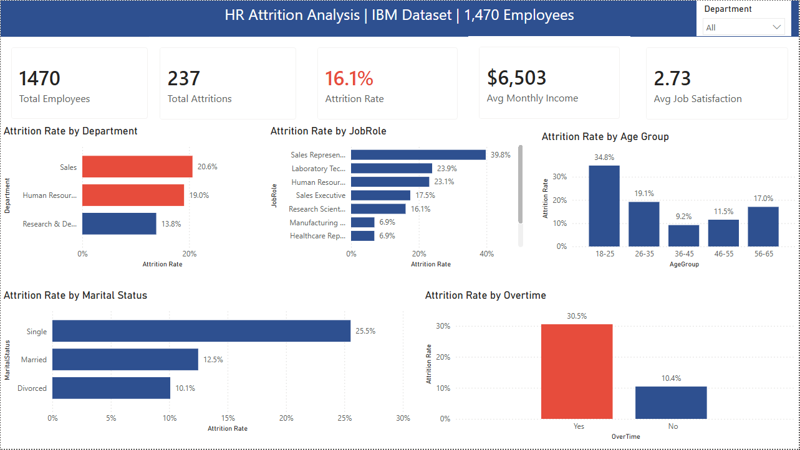
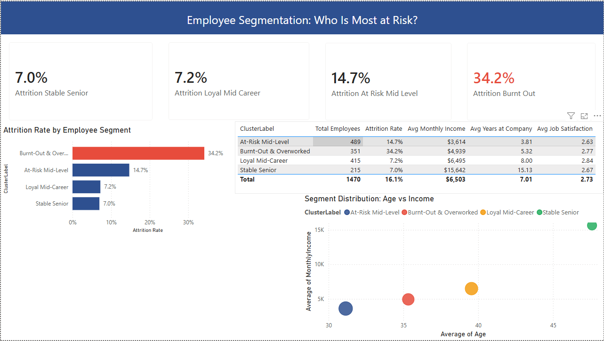
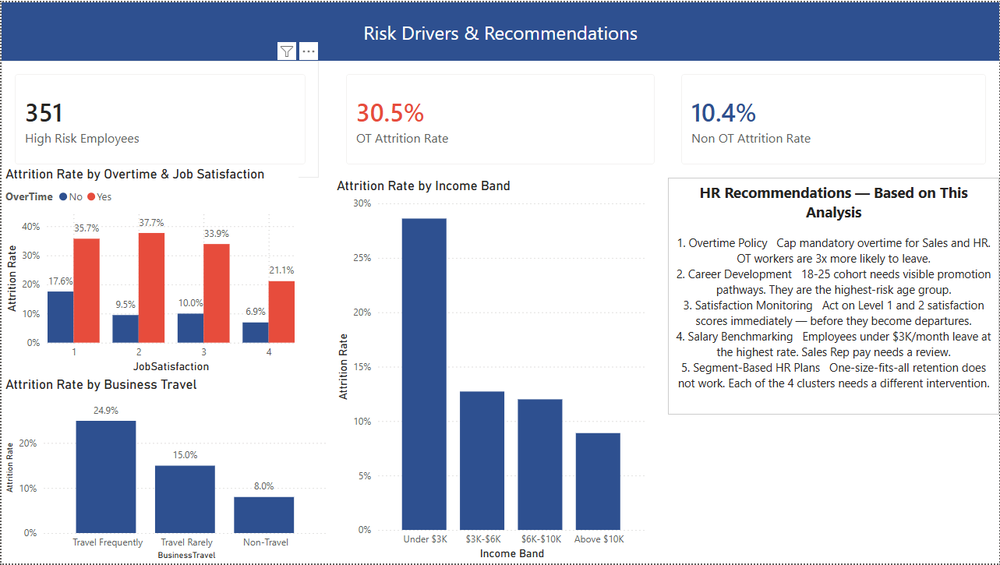

# HR Employee Attrition Analysis

**Which employee segments are most at risk of attrition, and what combination of factors drives it?**

---

## Business Context

Employee attrition is one of the most expensive and disruptive problems an organisation can face. Replacing a single employee costs an estimated 50–200% of their annual salary when you factor in recruitment, onboarding, and lost productivity. This project uses IBM's HR Analytics dataset to identify the hidden patterns behind who leaves and why.

The analysis goes beyond simple attrition counts. Using K-Means clustering and logistic regression, I segmented the workforce into four distinct profiles and ranked the factors that drive each group's attrition risk. The goal is to give HR teams an evidence-based foundation for targeted retention strategies.

---

## Dataset

**Source:** [IBM HR Analytics Employee Attrition Dataset](https://www.kaggle.com/datasets/pavansubhasht/ibm-hr-analytics-attrition-dataset) — Kaggle  
**Size:** 1,470 employees × 35 features  
**Period:** Cross-sectional (single snapshot)  
**Target variable:** Attrition (Yes/No), 237 leavers (16.1%)  
**Features include:** Age, Department, Job Role, Monthly Income, Job Satisfaction, Environment Satisfaction, Work-Life Balance, Overtime, Years at Company, Business Travel, and more

---

## Approach

### 1. Exploratory Data Analysis
Attrition rates broken down by department, job role, age group, gender, marital status, and overtime status. Satisfaction score distributions compared between leavers and stayers. Full correlation matrix across all 31 numeric features.

### 2. K-Means Clustering (Segmentation)
Clustered employees into 4 segments using 11 features most associated with attrition. The elbow method confirmed k=4 as the optimal number of clusters. Each cluster was profiled and labelled based on its characteristics.

| Segment | Size | Attrition Rate | Avg Income | Avg Tenure |
|---|---|---|---|---|
| Stable Senior | 215 | 7.0% | $15,642 | 15.1 years |
| Loyal Mid-Career | 415 | 7.2% | $6,495 | 8.0 years |
| At-Risk Mid-Level | 489 | 14.7% | $3,614 | 3.8 years |
| Burnt-Out & Overworked | 351 | **34.2%** | $4,939 | 5.3 years |

### 3. Logistic Regression (Feature Importance)
Trained a logistic regression model (balanced class weights, ROC-AUC = 0.81) to rank the top drivers of attrition. Overtime, Monthly Income, Age, and Years at Company emerged as the most significant predictors.

### 4. Power BI Dashboard
Three-page interactive dashboard built in Power BI Desktop covering executive summary, segment analysis, and risk drivers with actionable recommendations.

---

## Key Findings

| Finding | Metric |
|---|---|
| Overall attrition rate | 16.1% (237 of 1,470 employees) |
| Highest-risk job role | Sales Representative — 39.8% attrition |
| Highest-risk department | Sales — 20.6% attrition |
| Overtime workers attrition rate | 30.5% vs 10.4% for non-OT workers |
| Highest-risk age group | 18-25 — 34.8% attrition |
| Highest-risk marital status | Single — 25.5% attrition |
| OT + Satisfaction Level 1 | ~36% attrition — most dangerous combination |
| Highest-risk income band | Under $3K/month — ~29% attrition |
| Frequent travellers | 24.9% attrition vs 8.0% for non-travellers |
| ML model performance | ROC-AUC = 0.81 |

---

## Dashboard Preview

### Page 1 — Executive Summary

### Page 2 — Segment Analysis

### Page 3 — Risk Drivers & Recommendations

---

## Recommendations

| Priority | Recommendation | Target Group |
|---|---|---|
| High | Cap mandatory overtime — OT workers leave at 3x the rate of non-OT | Sales, HR departments |
| High | Introduce transparent promotion timelines and mentorship | 18-25 age cohort |
| High | Act immediately on Satisfaction Level 1 and 2 scores | All departments |
| Medium | Benchmark Sales Rep salaries against market rates | Sales Representatives |
| Medium | Design segment-specific retention plans for each of the 4 clusters | HR leadership |
| Low | Review frequent travel policies — consider remote options | Road-heavy roles |

---

## Files

| File | Description |
|---|---|
| `HR_Attrition_Analysis.ipynb` | Full EDA, K-Means clustering, and logistic regression notebook |
| `HR_Attrition_Cleaned.csv` | Cleaned dataset with cluster labels — ready for Power BI |
| `HR_Attrition_Dashboard.pbix` | Power BI dashboard (3 pages) |
| `WA_Fn-UseC_-HR-Employee-Attrition.csv` | Original IBM dataset |

---

## Tools Used

| Tool | Purpose |
|---|---|
| Python (Pandas, NumPy) | Data cleaning and EDA |
| Seaborn, Matplotlib | Visualisations in the notebook |
| Scikit-learn | K-Means clustering and logistic regression |
| Power BI Desktop | Interactive 3-page dashboard |

---

## What I Would Do With More Time and Data

- Add a **survival analysis** (Kaplan-Meier) to model time-to-attrition rather than just whether someone left
- Use a **Random Forest or XGBoost** model for higher predictive accuracy and SHAP values for interpretability
- Connect to **real-time HR data** via API to make the Power BI dashboard a live monitoring tool
- Build a **risk score** for each current employee so HR can intervene proactively before attrition happens
- Validate the cluster segments with qualitative data (exit interviews, engagement surveys)

---

## Author

**Somto Ogene**  
Data Analyst | Python · Power BI · SQL | PhD Researcher  
[LinkedIn](https://www.linkedin.com/in/ogenesomto) · [GitHub](https://github.com/sosetech)
